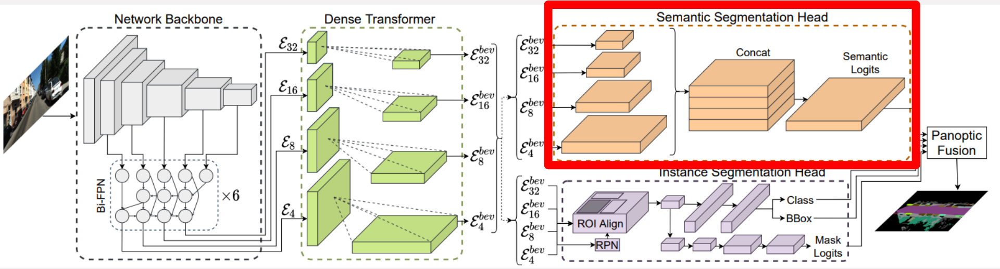

# Bird's-Eye-View Panoptic Segmentation Using Monocular Frontal View Images

This is the repository for group 33 in the course Deep Learning for Autonomous Vehicles (CIVIL-459) at EPFL, spring 2023. The task of this project is to assign semantic labels to every pixel of an aerial image viewed from a top-down view perspective (bird's eye view). The goal is to segment the image into different regions based on the objects or areas present in the scene, such as roads, vehicles, buildings etc. The solution we aim to implement is a semantic segmentation of monocular image/video taken from the front
view of an autonomous vehicle. Rather than giving the results as an overlay to the input image, we will produce
a semantically segmented map in a bird’s eye view perspective. These results can be achieved with a deep
learning network which are trained on existing datasets. The final segmented map can be used as input to other
predicting- and controlling systems in the autonomous vehicle. The paper we chose for our project is the following: https://arxiv.org/pdf/2108.03227.pdf
 

The repository is forked and modified from https://github.com/robot-learning-freiburg/PanopticBEV.

# Content
1. Contributions
2. Experiments
3. Results
4. Conclusion
5. Setup and running code

## 1. Contributions


We chose to focus our efforts on the Semantic Segmentation Head in the model. PanopticBEV is one of the few models that also incorporates instance segmentation and the results from the instance segmentation head is combined with the results from the semantic segmentation head. We therefore hypothesized that changing the level of detail in the semantic segmentation head will give more prevelance for the instance segmentation head. Thus the parts where the instance segmentation head performes better will have more weight in the final output. 

Our contribution is aimed at the size of the convolutional layer after the concatination of the inputs from the dense transformer. This convolutional layer has a certain number of hidden channels. We ran experiments with different sizes in this hidden layer.

## 2. Experiments
We trained the model for 10 epochs with the standard 128 hidden channels in the semantic segmentation concolutional layer. We then performed one more epoch for three different versions. One version continuing 128 hidden channels for a baseline, and then two different version with 96 and 64 hidden channels.

## 3. Results

In the paper, they also have results for the Kitti-360 dataset but due to lack of time and ressources, we could only test our modifications on the nuscenes dataset. We were only able to train with one epoch. We compare our results (64 and 96 hidden channels) with the results from the paper (128 hidden channels) in the following tables:
All values are in [%].

|Dataset  |# h channels | PQ    | SQ    | RQ    | PQ_th | SQ_th | RQ_th | PQ_st | SQ_st | RQ_st |
|---------|-------------|-------|-------|-------|-------|-------|-------|-------|-------|-------|
|nuscenes | 128         | 9.31  | 53.73 | 14.28 | 1.33 | 44.51 | 2.22  | 14.63 | 59.87 | 22.31 | 
|nuscenes | 96          | 10.18 | 48.35 | 15.61 | 1.83  | 30.63 | 3.01  | 15.75 | 60.17 | 24.01 |
|nuscenes | 64          | 10.09 | 55.06 | 15.38 | 1.69  | 46.44 | 2.81  | 15.69 | 60.81 | 23.75 |

PQ: Panoptic quality metric, captures performance for all classes (stuff and things)

SQ: Segmentation quality, evaluates how close the segments are to the ground truths

RQ: Recognition qualits metric, identifies how effective the model is to predict a model right

|Dataset  |# h channels|Road  |Side. |Manm. | Veg. | Ter. | Occ. | Per. | 2-Wh.| Car  | Truck| mIoU |
|---------|------------|------|------|------|----- |------|------|------|------|------|------|------|
|nuscenes | 128        | 64.93| 14.17| 27.87| 21.84| 19.37| 26.28| 2.83 | 0.15 | 22.68| 17.11| 21.72|
|nuscenes | 96         | 63.98| 15.95| 29.17| 27.65| 23.13| 28.09|  2.3 |  0.61|  22.8| 18.37|  23.2|
|nuscenes | 64         | 67.11| 16.68| 28.57| 32.22| 19.17| 27.72| 2.69 |  0.09| 24.93|  22.4| 24.16|

We notice that overall we achieved better results with 64 hidden channels. Our results are slightly better than the ones from the paper with one epoch. To be able to compare with the final version in the paper however, we would need to train it for the full 30 epochs.

You can download our models and checkpoints from this link: https://drive.google.com/drive/folders/1BOfgEw2zB_JvMVTVpVFBbc5suGKHAuhx?usp=share_link

## 4. Conclusion
To have more accurate comparisons one could train our models with 30 epochs like they did in the paper, then we would be able to actually compare the performances. The 64 and 96 models use fewer informations from the semantic segmentation head and more from the instance segmentation head so to improve the performances one could try to improve the relationship between the two heads.


## 5. Setup and running code 
### Setup on SCITAS
1. Connect to izar server
```shell
ssh -X username@izar.epfl.ch
```

2. Create new folder
```shell
mkdir DLAV
cd DLAV
```

3. Clone this repository
```shell
git clone https://github.com/SamiLaubo/PanopticBEV.git
```

4. Setup environment
```shell
module load gcc/8.4.0-cuda python/3.7.7 cuda/11.1.1
python3 -m venv venv/panoptic_bev
source venv/panoptic_bev/bin/activate
```

5. Install torch with CUDA
```shell
python -m pip install torch==1.8.1+cu111 -f https://download.pytorch.org/whl/cu111/torch_stable.html --no-cache-dir
python -m pip install torchvision==0.9.1+cu111 -f https://download.pytorch.org/whl/cu111/torch_stable.html --no-cache-dir
```

6. Double check
```shell
python --version
nvcc --version
python -c "import torch; print(torch.__version__)"
which python
```

Should give respectively 3.7.7, 11.1, 1.8.1+cu111, and lastly point to python environment.

7. More dependencies
```shell
cd PanopticBEV
python -m pip install -r requirements.txt --no-cache-dir
```

8. inplace_abn package needs to be install while connected to a gpu (ex. in Sinteract):
```shell
Sinteract -g gpu:1 -p gpu -c 1 -m 10G -t 00:90:00
python -m pip install git+https://github.com/mapillary/inplace_abn.git --no-cache-dir
```

9. Run setup
```shell
python setup.py develop
```

### Import dataset
For this project, we use two datasets, the nuscenes dataset and a modified version of it: nuscenes PanopticBEV. The first one consists of 1000 20 seconds long driving scenes collected in Boston and Sinagapore. The second one is a new dataset introduced in the paper that provides ground truths for the nuscenes dataset.
The nuscenes dataset is already in the shared directory on scitas.

1. Download NuScenes PanopticBEV dataset from http://panoptic-bev.cs.uni-freiburg.de/#dataset.
2. Make folder for data
```shell
cd .. (Back to DLAV)
mkdir nuscenes
```
4. Copy from loacal folder to server:
  - Open new cmd or exit ssh (make sure to be on local computer)
```shell
scp -r /path/to/nuscenes_panopticbev.zip username@izar.epfl.ch:/home/username/DLAV/nuscenes
```
  - Full path to file can on Windows be found by right-click -> properties
5. Unpack
```shell
cd nuscenes
unzip nuscenes_panopticbev.zip
```

### Pretrained weights
1. Download weights from https://drive.google.com/drive/u/3/folders/1qk4PwHl_1JtyzEEZW-lbbbAh2GY5y8ff
2. Copy to server
```shell
In SCITAS:
cd DLAV
mkdir pretrained_weights

On local computer:
scp path/to/weights.pth username@izar.epfl.ch:/home/USERNAME/DLAV/pretrained_weights
```

### Training model
To train the model one submits an sbatch job to SCITAS:

1. Edit **experiments/config/nuscenes.ini** if necessary
    - epochs: 1 epoch ~ 6 hours
    - Change sem_hidden_channels (Optional, standard = 128)
    - Continue training on pretrained weights: 
      - weights = "Path to stored weights" 
      - Ex.: /home/USERNAME/DLAV/pretrained_models/best_model.pth
2. Edit **scripts/scitas_train_nuscenes.run**
    - Change USERNAME to own username
    - Change run_name to preferred name
    - Update paths if necessary
3. Submit job
    - sbatch scitas_train_nuscenes.run
